# ✨SOCIAL VALORANT✨
### ✨By Gisbel Contreras y Karen Baron✨

---
## Índice

* [1. Introducción](#1-introducción)
* [2. Resumen del proyecto](#2-resumen-del-proyecto)
* [3. Objetivos de aprendizaje](#3-objetivos-de-aprendizaje)

------

## 1. Introducción

Social valorant es una red enfocada a los jugadores seguidores de Valorant, en esta los usuarios podrán publicar, darse like, editar sus publicaciones y hasta eliminarlos, pero sobre todo el objetivo principal de nuestra red social es que nuestros usuarios puedan encontrar más personas con sus mismos gustos para poder jugar entre todos.

----

## 2. Resumen del proyecto
### 1. Proceso de diseño:

Para iniciar nuestro proceso de creación lo primero que hicimos fue crear un formulario de Google, donde le preguntamos a diferentes usuarios que les gustaría ver en una red social basada para jugadores de Valorant, pusimos preguntas básicas como cual es el equipo que usan para ingresar a sus redes sociales, que quieren ver en una red social y si usurarían nuestra red para encontrar a más jugadores, además de preguntar por su rango de edad.

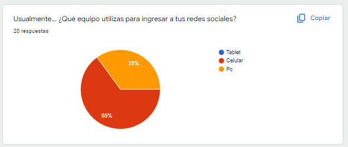
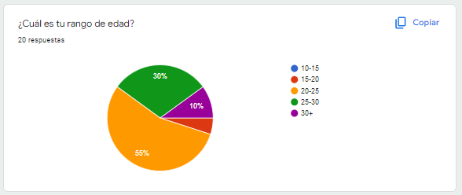
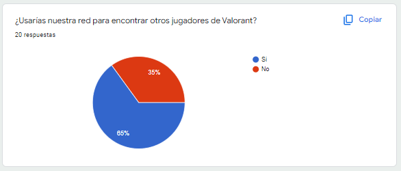
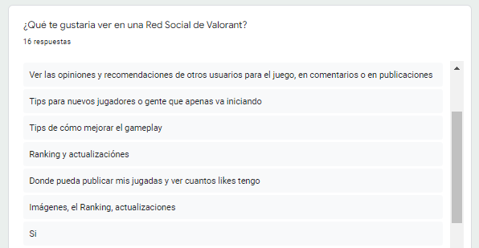

Ya con esto definido creamos ocho historias de usuario diferentes enfocadas tanto en las necesidades de los usuarios como en nuestros objetivos de aprendizaje, siendo nuestros objetivos principales el poder registrarse, iniciar sesión, publicar, dar like, borrar la publicación y editar la publicación.

### 2. Historias de usuario:

### A. Historia de usuario No. 1 👩‍🦰:
- "Yo como usuario me gustaria poder registrarme con mi correo electronico y que no sea posible para otros entrar con el."

### B. Historia de usuario No. 2 👨‍🦱:
- "Quisiera poder registrarme con mi cuenta de google, ya que seria mas comodo para mi manejar la cuenta de esa manera.
"

### C. Historia de usuario No. 3 👩‍🦱:
- "Como usuario me gustaria ver un muro donde pueda ver las publicaciones de otras personas."

### D. Historia de usuario No. 4 🧑:
- "Me gustaria poder dar like y dislike a una publicacion para opinar sobre esta."

### D. Historia de usuario No. 5 👱‍♀️:
- "Como usuario quiero cerrar mi sesion para mantenerla segura."

### D. Historia de usuario No. 6 👩‍🦳:
- "Como usuario quiero postear cuando voy a jugar, cuando voy ganando o cuando quiero agregar mas amigos a la cuenta."

### D. Historia de usuario No. 7 👨‍🦲:
- "Cuando escriba un post me gustaria poder eliminarlo del muro."

### D. Historia de usuario No. 8 🧒:
- "Como usuario quiero poder editar mis post por si me llego a equivocar en lo que escribo."

### 3. Creacion del diseño:

Seguimos avanzando en nuestro proyecto, creado nuestro primer prototipo en figma, haciendo el diseño tanto para móviles como para computadores, haciendo nuestro diseño de baja fidelidad.

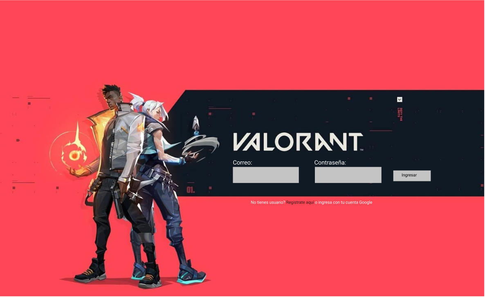
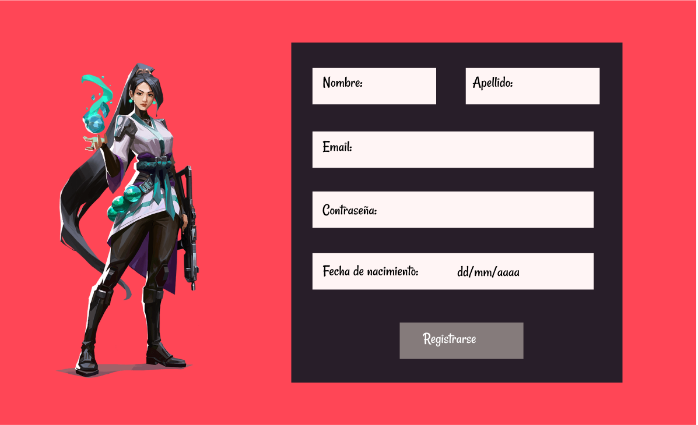
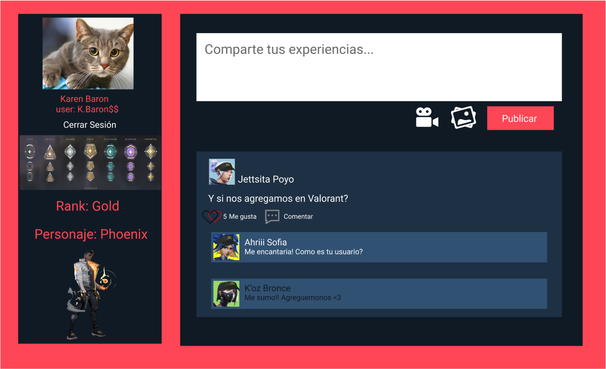

#### Diseño movil:
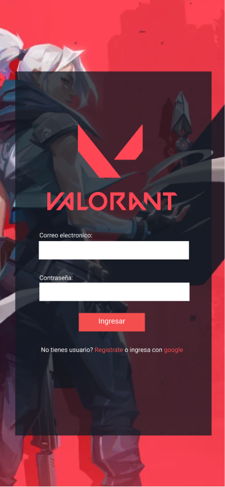
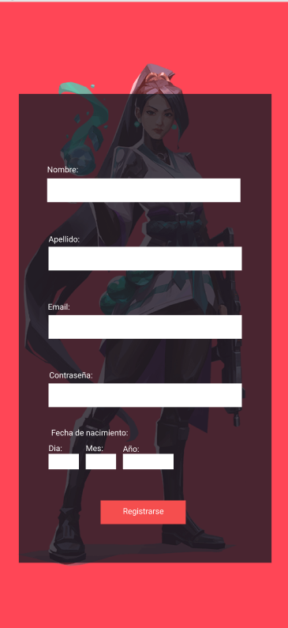
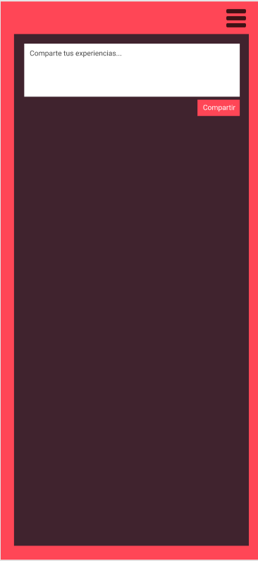

### 4. Diseño final:

Al final, con la retro alimentación recibida nos fijamos en implementar el diseño de teléfonos primero, y poner colores más fríos para el gusto de los usuarios y de la temática del juego, quedando al final así:

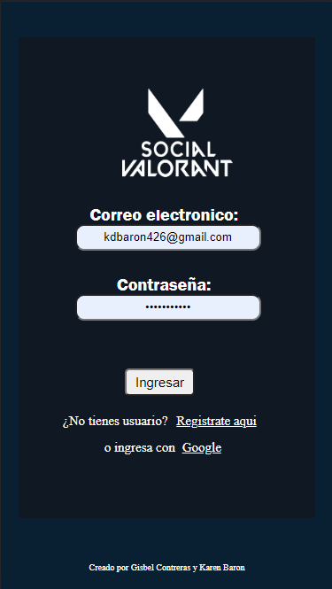
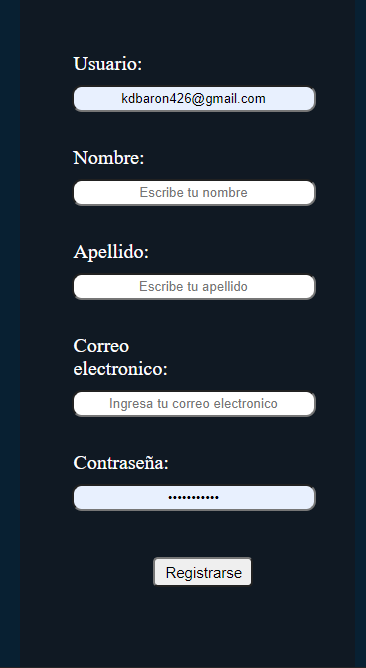
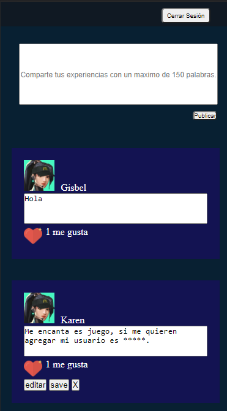

----
## 3. Objetivos de aprendizaje

Reflexiona y luego marca los objetivos que has llegado a entender y aplicar en tu proyecto. Piensa en eso al decidir tu estrategia de trabajo.

### HTML

- [X] **Uso de HTML semántico**

### CSS

- [X] **Uso de selectores de CSS**

- [X] **Modelo de caja (box model): borde, margen, padding**

- [X] **Uso de flexbox en CSS**

- [X] **Uso de CSS Grid Layout**

### Web APIs

- [X] **Uso de selectores del DOM**

- [X] **Manejo de eventos del DOM (listeners, propagación, delegación)**

- [X] **Manipulación dinámica del DOM**

- [X] **Ruteado (History API, evento hashchange, window.location)**

### JavaScript

- [X] **Arrays (arreglos)**

- [ ] **Objetos (key, value)**

- [X] **Diferenciar entre tipos de datos primitivos y no primitivos**

- [X] **Variables (declaración, asignación, ámbito)**

- [X] **Uso de condicionales (if-else, switch, operador ternario, lógica booleana)**

- [ ] **Uso de bucles/ciclos (while, for, for..of)**

- [X] **Funciones (params, args, return)**

- [ ] **Pruebas unitarias (unit tests)**

- [ ] **Pruebas asíncronas**

- [ ] **Uso de mocks y espías**

- [X] **Módulos de ECMAScript (ES Modules)**

- [X] **Uso de linter (ESLINT)**

- [X] **Uso de identificadores descriptivos (Nomenclatura y Semántica)**

- [X] **Diferenciar entre expresiones (expressions) y sentencias (statements)**

- [ ] **Callbacks**

- [X] **Promesas**

### Control de Versiones (Git y GitHub)

- [X] **Git: Instalación y configuración**

- [X] **Git: Control de versiones con git (init, clone, add, commit, status, push, pull, remote)**

- [X] **Git: Integración de cambios entre ramas (branch, checkout, fetch, merge, reset, rebase, tag)**

- [X] **GitHub: Creación de cuenta y repos, configuración de llaves SSH**

- [X] **GitHub: Despliegue con GitHub Pages**

- [X] **GitHub: Colaboración en Github (branches | forks | pull requests | code review | tags)**

- [X] **GitHub: Organización en Github (projects | issues | labels | milestones | releases)**

### user-centricity

- [X] **Diseñar un producto o servicio poniendo a la usuaria en el centro**

### product-design

- [X] **Crear prototipos de alta fidelidad que incluyan interacciones**

- [X] **Seguir los principios básicos de diseño visual**

### research

- [] **Planear y ejecutar testeos de usabilidad de prototipos en distintos niveles de fidelidad**

### Firebase

- [X] **Firebase Auth**

- [X] **Firestore**

